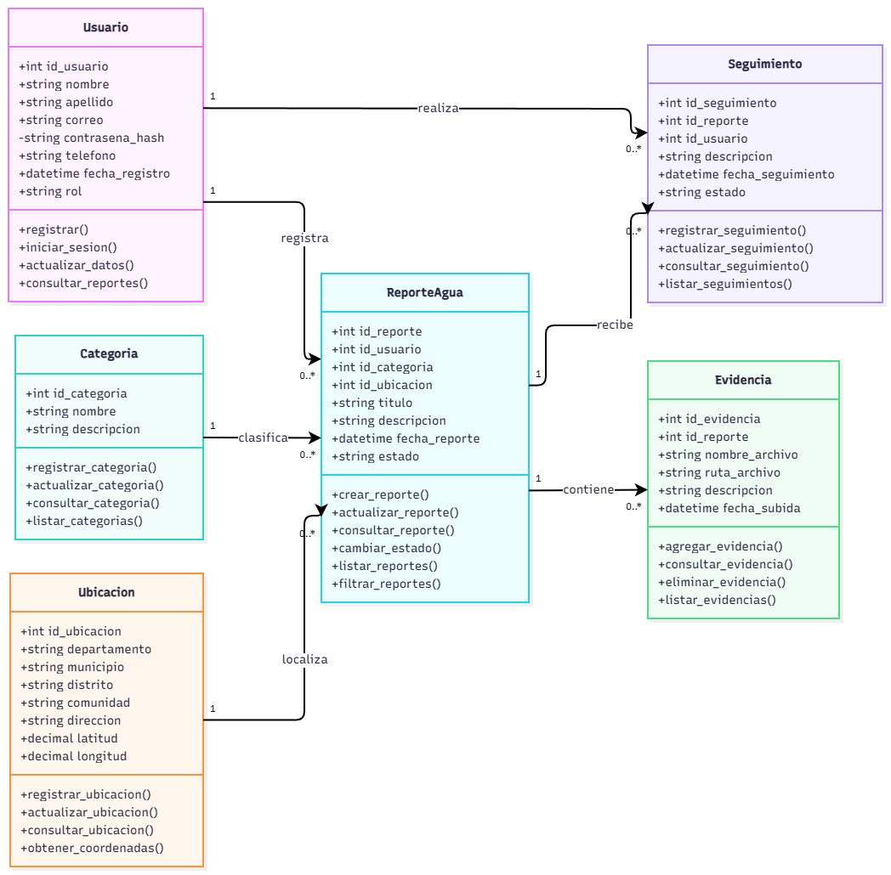

# AquaAlerta

## Sistema Comunitario de Monitoreo y Reporte de Problemas Relacionados con el Agua

## Descripción del proyecto

AquaAlerta es un proyecto de proyección social orientado al desarrollo de una aplicación web comunitaria que permita registrar, localizar y dar seguimiento a problemas relacionados con la calidad y el servicio de agua.

La aplicación permitirá a los habitantes reportar situaciones como presencia de sedimentos, color u olor anormal en el agua, falta de agua, baja presión, servicio intermitente, fugas, tuberías dañadas y otros problemas relacionados con el suministro.

Los reportes podrán incluir información sobre el tipo de problema, descripción, ubicación y evidencia fotográfica. Además, se propone incorporar un mapa que permita visualizar los sectores donde se han registrado problemas y consultar el estado de cada reporte.

## Problemática

En la comunidad El Cobano existen diferentes situaciones relacionadas con la calidad y el servicio de agua. Entre ellas se encuentra la presencia de sedimentos y suciedad, formando lo que algunos habitantes conocen como "capa rosa", una acumulación similar a tierra que puede observarse en el agua y en los recipientes donde se almacena.

Además de los problemas relacionados con la calidad del agua, pueden presentarse inconvenientes como falta de agua, baja presión, servicio intermitente, fugas y tuberías dañadas.

Actualmente no existe un medio comunitario que permita registrar de manera organizada cuándo ocurren estos problemas, qué tipo de situación se presenta, en qué sector sucede y cuál es el seguimiento realizado.

AquaAlerta busca contribuir a la organización de esta información mediante el registro, ubicación y seguimiento de los reportes realizados por los habitantes.

## Comunidad beneficiaria

El proyecto AquaAlerta estará dirigido inicialmente a los habitantes de la comunidad El Cobano, ubicada en el municipio de Santa Rita, departamento de Chalatenango.

Los principales beneficiarios serán las familias que reciben y utilizan diariamente el suministro de agua de la comunidad.

## Objetivo

Desarrollar una aplicación web comunitaria que permita registrar, localizar, organizar y dar seguimiento a problemas relacionados con la calidad y el servicio de agua, facilitando la recopilación de evidencias, la identificación de los sectores afectados y la consulta del estado de los reportes realizados.

## Integrantes

- Marjhory Odalis Alvarez Cortez
- Manuel Ernesto Quijada Gutierrez
- Leidy Elizabeth Landaverde Alas
- René Vladimir Quintanilla Mancia

## Tipos de usuarios

### Habitante de la comunidad

Será el usuario encargado de registrar los problemas relacionados con la calidad y el servicio de agua que se presenten en su vivienda o sector.

Podrá crear reportes, seleccionar el tipo de problema, agregar una descripción, indicar la ubicación, adjuntar fotografías como evidencia y consultar el seguimiento de los reportes.

### Encargado o representante de la comunidad

Será responsable de revisar los reportes realizados por los habitantes y dar seguimiento a las situaciones relacionadas con la calidad y el servicio de agua.

Podrá consultar reportes, revisar evidencias, actualizar el estado de los casos y agregar observaciones de seguimiento.

### Administrador

Será responsable de administrar y supervisar el funcionamiento general de AquaAlerta.

Podrá administrar usuarios, categorías y reportes, además de supervisar los estados de los casos y mantener organizada la información del sistema.

## Requisitos funcionales

### RF01 - Registro de usuarios
El sistema permitirá registrar usuarios para acceder a las funciones correspondientes de la plataforma.

### RF02 - Inicio de sesión
El sistema permitirá a los usuarios iniciar sesión mediante sus credenciales.

### RF03 - Registro de reportes
El sistema permitirá crear reportes relacionados con problemas de calidad y servicio de agua.

### RF04 - Selección de categoría
El usuario podrá seleccionar el tipo o categoría del problema al realizar un reporte, como falta de agua, baja presión, fugas, tuberías dañadas o alteraciones en la calidad del agua.

### RF05 - Descripción del problema
El usuario podrá agregar una descripción con información sobre la situación reportada.

### RF06 - Evidencia fotográfica
El usuario podrá adjuntar fotografías como evidencia del problema.

### RF07 - Ubicación del reporte
El sistema permitirá asociar una ubicación o sector al reporte realizado.

### RF08 - Consulta de reportes
Los usuarios podrán consultar los reportes registrados y conocer la información disponible de cada caso.

### RF09 - Actualización del estado
El encargado o representante podrá actualizar el estado de los reportes, por ejemplo: Pendiente, En revisión o Atendido.

### RF10 - Seguimiento de reportes
El encargado podrá agregar observaciones relacionadas con el seguimiento de cada caso.

### RF11 - Búsqueda y filtrado
El sistema permitirá buscar y filtrar los reportes según categoría, ubicación o estado.

### RF12 - Mapa de reportes
El sistema permitirá visualizar en un mapa los sectores donde se han registrado problemas relacionados con el agua.

### RF13 - Identificación visual del estado
Los marcadores del mapa permitirán diferenciar visualmente el estado de cada reporte.

### RF14 - Consulta desde el mapa
El usuario podrá seleccionar un marcador del mapa para consultar información básica del reporte correspondiente.

### RF15 - Resumen de reportes
El sistema mostrará un resumen de los reportes registrados y sus diferentes estados.

## Requisitos no funcionales

### RNF01 - Diseño adaptable
La aplicación deberá adaptarse correctamente a diferentes tamaños de pantalla, permitiendo su utilización tanto en computadoras como en dispositivos móviles.

### RNF02 - Validación de datos
Los formularios deberán validar los campos obligatorios antes de permitir el registro de la información.

### RNF03 - Seguridad y autenticación
El sistema deberá proteger el acceso a las funciones que requieran autenticación y controlar los permisos según el tipo de usuario.

### RNF04 - Almacenamiento de información
La información de usuarios, reportes, ubicaciones, estados y demás datos del sistema deberá almacenarse de manera organizada en una base de datos.

### RNF05 - Usabilidad
La interfaz deberá ser clara, sencilla y fácil de utilizar para facilitar su uso por parte de los habitantes de la comunidad.

### RNF06 - Protección de datos
La aplicación deberá proteger los datos personales de los usuarios y evitar mostrar públicamente información privada innecesaria.

### RNF07 - Manejo de evidencias
Las fotografías agregadas como evidencia deberán almacenarse y relacionarse correctamente con el reporte correspondiente.

### RNF08 - Disponibilidad de la información
Los reportes y su estado deberán mantenerse disponibles para su consulta de acuerdo con los permisos asignados a cada tipo de usuario.

## Estado del proyecto

Actualmente, AquaAlerta se encuentra en la etapa de diagnóstico de la problemática y definición de los requisitos iniciales del sistema.

Durante esta etapa se está recopilando información de los habitantes de la comunidad para conocer sus principales necesidades y utilizar los resultados como base para continuar con el diseño y desarrollo de la aplicación.

## Proyecto académico

**Universidad:** Universidad Dr. Andrés Bello  
**Regional:** Chalatenango  
**Carrera:** Ingeniería en Sistemas y Computación  
**Asignatura:** Programación Orientada a Objetos  
**Docente:** Francisco Daniel Peñate Mena  
**Equipo:** 2  
**Ciclo:** 02-2026

---

# Semana 3: Diseño de Clases UML y Modelado de Base de Datos

## 1. Introducción

Durante la tercera semana del proyecto AquaAlerta, el Equipo 02
desarrolló el diseño de clases UML y el modelo relacional de la
base de datos.

Esta etapa tiene como objetivo establecer la estructura del sistema
mediante los principios de Programación Orientada a Objetos (POO)
y el diseño de una base de datos relacional en SQL Server.

Los avances permitirán continuar con la implementación de una
plataforma comunitaria para registrar y dar seguimiento a
problemas relacionados con la calidad y el servicio de agua.

## 2. Objetivos de la Semana 3

- Revisar los requisitos funcionales y no funcionales.
- Identificar las clases principales del sistema.
- Definir atributos, métodos y relaciones.
- Aplicar los principios de Programación Orientada a Objetos.
- Elaborar el diagrama de clases UML.
- Diseñar el modelo relacional de la base de datos.
- Establecer claves primarias y foráneas.
- Elaborar el diccionario de datos.
- Relacionar las clases UML con las tablas SQL.

## 3. Diseño de Clases UML

Se identificaron seis clases principales:

| Clase | Descripción |
|---|---|
| Usuario | Gestiona la información de los usuarios y sus roles. |
| Categoria | Clasifica los problemas relacionados con el agua. |
| Ubicacion | Almacena la información geográfica de los reportes. |
| ReporteAgua | Gestiona los reportes realizados por los habitantes. |
| Evidencia | Administra las evidencias asociadas a los reportes. |
| Seguimiento | Registra las observaciones y actualizaciones. |

### Diagrama de clases

El diagrama UML representa los atributos, métodos y relaciones
entre las seis clases principales.

Archivo editable:
[Diagrama UML en Draw.io](diagramas/AquaAlerta_Diagrama_Clases_UML.drawio)

## 4. Aplicación de Programación Orientada a Objetos

En el diseño del sistema se aplicaron los siguientes conceptos:

- **Clases:** Representan los componentes principales del sistema.
- **Objetos:** Instancias de las clases con información específica.
- **Atributos:** Definen las características de cada clase.
- **Métodos:** Representan las operaciones del sistema.
- **Encapsulamiento:** Permite proteger información sensible.
- **Abstracción:** Identifica las características esenciales.
- **Asociación:** Establece relaciones entre las clases.

La herencia y el polimorfismo no fueron necesarios para
la estructura inicial del proyecto.

## 5. Modelo Relacional de la Base de Datos

Se diseñó la base de datos AcuaAlerta utilizando
Microsoft SQL Server.

### Tablas principales

1. Usuario
2. Categoria
3. Ubicacion
4. ReporteAgua
5. Evidencia
6. Seguimiento

### Relaciones

Se definieron seis claves foráneas:

| Tabla de origen | Tabla relacionada |
|---|---|
| ReporteAgua | Usuario |
| ReporteAgua | Categoria |
| ReporteAgua | Ubicacion |
| Evidencia | ReporteAgua |
| Seguimiento | ReporteAgua |
| Seguimiento | Usuario |

Estas relaciones permiten mantener la integridad
referencial de la información almacenada.

## 6. Categorías de Reportes

El sistema contempla nueve categorías:

1. Agua turbia.
2. Mal olor.
3. Sedimentos.
4. Posible contaminación.
5. Coloración anormal.
6. Falta de agua.
7. Baja presión.
8. Fugas de agua.
9. Tuberías dañadas.

## 7. Estados de los Reportes

Los estados definidos son:

- **Pendiente:** El reporte fue registrado.
- **En revisión:** El problema está siendo evaluado.
- **Atendido:** Se registró la atención del reporte.

## 8. Roles de Usuario

Se establecieron tres roles:

- **Habitante:** Registra y consulta reportes.
- **Representante comunitario:** Participa en el seguimiento.
- **Administrador:** Gestiona la información del sistema.

## 9. Diccionario de Datos

Se elaboró un diccionario de datos que describe los campos,
tipos de datos, claves primarias, claves foráneas y
restricciones de las seis tablas.

Esta documentación facilita la comprensión de la estructura
de la base de datos y servirá como referencia durante
la implementación del sistema.

## 10. Archivos de la Semana 3

Los archivos técnicos desarrollados durante la Semana 3
se encuentran organizados en el repositorio de GitHub.

### Base de datos

Se desarrolló la estructura relacional de la base de datos
AcuaAlerta utilizando Microsoft SQL Server.

El script contiene las seis tablas principales, sus claves
primarias, claves foráneas y restricciones.

**Archivo SQL:**

[Ver script SQL de AcuaAlerta](Base%20de%20datos%20AquaAlerta/AcuaAlerta_BaseDatos.sql)

### Diagramas UML

Se elaboró el diagrama de clases UML, que representa
las seis clases principales del sistema, sus atributos,
métodos y relaciones.

**Archivo editable de Draw.io:**

[Ver diagrama UML editable](Diagramas/AquaAlerta_Diagrama_Clases_UML.drawio)

**Imagen del diagrama UML:**

[Ver diagrama UML en PNG](Diagramas/AquaAlerta_Diagrama_Clases_UML.drawio.png)

### Visualización del diagrama

## 11. Herramientas Utilizadas

- Microsoft SQL Server.
- SQL Server Management Studio.
- Draw.io (diagrams.net).
- Google Docs.
- Google Drive.
- GitHub.

## 12. Integrantes del Equipo

**Universidad Dr. Andrés Bello**

**Carrera:** Ingeniería en Sistemas y Computación

**Proyecto:** AquaAlerta

**Equipo:** 02

**Integrantes:**

- Manuel Ernesto Quijada Gutiérrez.
- Marjhory Odalis Álvarez Cortez.
- Leidy Elizabeth Landaverde Alas.
- René Vladimir Quintanilla Mancia.

## 13. Resultados de la Semana 3

Durante esta etapa se completaron:

- La identificación de las seis clases principales.
- El diseño del diagrama de clases UML.
- El diseño de las seis tablas de la base de datos.
- La definición de seis claves foráneas.
- La incorporación de roles de usuario.
- La definición de nueve categorías de reportes.
- La unificación de los estados del sistema.
- La elaboración del diccionario de datos.
- La correspondencia entre clases UML y tablas SQL.

## 14. Próximas Etapas

En las siguientes fases se continuará con la implementación
de las funcionalidades de AquaAlerta, utilizando como base
el diseño UML y la estructura relacional desarrollados
durante esta semana.

El objetivo es avanzar hacia una aplicación que permita
registrar, consultar, localizar y dar seguimiento a los
problemas relacionados con el agua en la comunidad.
